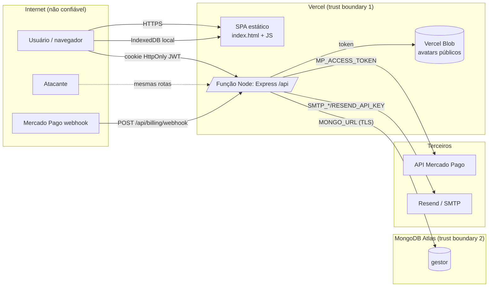

# 02 — Arquitetura real e superfície de ataque

## Componentes (derivados do código)

| Camada | Tecnologia | Onde |
|---|---|---|
| SPA (web + PWA instalável) | React 18, Vite 7, Tailwind, React Router 7, React Query, Dexie (IndexedDB), axios | `client/` — servido como estático pela Vercel (`vercel.json` rewrites `/((?!api/).*)` → `index.html`) |
| API | Express 4 em função serverless Node (`api/index.ts` → `server/src/app.ts`); helmet, cookie-parser, express.json (100 kB), morgan (dev) | rotas sob `/api` |
| Banco | MongoDB Atlas (Mongoose 8, `strictQuery`) — coleções `users`, `clients`, `tasks`, `financeentries`, `goals`, `goalcontributions`, `emailverifications` (TTL), `freeaccounts`, `payments` | `MONGO_URL` |
| Arquivos | Vercel Blob público (avatars, WebP 256×256) ou disco local `/uploads` em dev | `utils/avatar.ts` |
| E-mail | Resend (HTTPS) ou SMTP (nodemailer) — códigos de cadastro e links de reset | `services/mail.ts` |
| Pagamentos | Mercado Pago Checkout Pro (preference → redirect), confirmação por `POST /billing/confirm` e webhook | `services/billing.ts` |
| Identidade | Local (e-mail + senha, bcrypt 12); JWT HS256 7 dias em cookie HttpOnly (web) ou Bearer (legado nativo); sem MFA/SSO | `utils/jwt.ts`, `middleware/requireAuth.ts` |
| Admin | E-mails em `ADMIN_EMAILS` → `requireAdmin` | `controllers/admin.controller.ts` |
| Legado no repositório (não implantado) | `flutter_app/` (Flutter), `client/android/` (Capacitor) | fora do escopo |

## Diagrama

**Crown jewels:** `MONGO_URL` (todos os dados de todos os usuários), `JWT_SECRET` (forjar qualquer sessão), `MP_ACCESS_TOKEN` (loja no Mercado Pago), `SMTP_PASS`/`RESEND_API_KEY` (enviar e-mails em nome do produto), `BLOB_READ_WRITE_TOKEN`, a lista `ADMIN_EMAILS` e as contas admin.

## Inventário de entradas (rotas reais — `server/src/routes/*`)

| Método e rota | Auth | Plano | Observações |
|---|---|---|---|
| POST /api/auth/register/request-code | não | — | rate limit 6/15 min (por IP do proxy — AUD-003); envia e-mail; 409 revela conta existente (AUD-010) |
| POST /api/auth/register | não | — | exige código; cria usuário com trial |
| POST /api/auth/login | não | — | 20/15 min; devolve cookie + token no corpo |
| POST /api/auth/logout | não | — | limpa cookie (sem revogação — AUD-004) |
| GET /api/auth/me | sim | — | inclui `access` |
| POST /api/auth/forgot-password | não | — | resposta uniforme; link via `resolveAppUrl` (AUD-005) |
| GET/POST /api/auth/reset-password | não | — | token em query (GET) e corpo (POST) |
| POST /api/auth/change-password | sim | — | exige senha atual |
| GET/POST/PUT/PATCH/DELETE /api/clients[/:id][/status][/avatar] | sim | sim | escopo `userId` validado; avatar multipart (AUD-002, AUD-009) |
| GET/POST/PUT/PATCH/DELETE /api/tasks[/:id][/status] | sim | sim | escopo validado |
| GET/POST/PUT/DELETE /api/finance[/:id] | sim | sim | escopo validado; busca regex (AUD-006) |
| GET/POST/PUT/DELETE /api/goals[/:id], /goals/contributions/… | sim | sim | escopo validado |
| GET /api/billing/status, POST /billing/checkout, POST /billing/confirm | sim | — | confirm consulta MP (AUD-007) |
| POST /api/billing/webhook | não | — | assinatura opcional (AUD-015) |
| GET/POST/DELETE /api/admin/free-accounts[/:email] | admin | — | sem MFA/log (AUD-008) |
| GET /api/health | não | — | `{status:'ok'}` |
| GET /uploads/* | não | — | só em dev/disco |

Comparação com a documentação (README) e com a interface: todas as rotas usadas pelo SPA existem no servidor; não há rotas de debug, versões antigas ou endpoints sem uso (o antigo caminho `/lucros` é redirecionado no cliente). Drift: nenhum identificado.

## Egress (saídas do servidor)

Atlas (banco), api.resend.com ou SMTP configurado, api.mercadopago.com, Vercel Blob. Nenhum destino é derivado de entrada do usuário (SSRF não aplicável — controle validado).

## Fronteiras de confiança e observações

- **Navegador ↔ API:** tudo que vem do cliente é validado com zod; a decisão de plano e o preço são do servidor. Exceção: `avatarUrl` (AUD-009) e `updatedAt` (last-write-wins, afeta só o próprio usuário).
- **Proxy da Vercel ↔ Express:** o IP real não é reconhecido (AUD-003); o Host/Origin da requisição alimenta links de e-mail quando `APP_URL` falta (AUD-005).
- **Terceiros ↔ API:** o webhook não é confiado sem consulta ao Mercado Pago (bom), mas aceita chamadas anônimas quando sem segredo (AUD-015).
- **Dispositivo do usuário:** IndexedDB guarda todos os dados até "Sair" (AUD-018d); `access` também é cacheado, mas o servidor reforça o 402.

## Matriz ator × objeto × ação (fluxos de maior risco)

| Ator | Objeto | ler | criar | editar | excluir | Resultado |
|---|---|---|---|---|---|---|
| Anônimo | cliente/tarefa/finança de A | 401 | 401 | 401 | 401 | validado (T08) |
| Usuário B (canário) | cliente de A | 404 | — | 404 | 404 | validado (T08) |
| Usuário A | próprio `avatarUrl` arbitrário | — | — | 200 aceito | — | AUD-009 |
| Usuário com trial vencido | qualquer dado | 402 | 402 | 402 | 402 | validado (T10) |
| Usuário comum | `/api/admin/*` | 403 | 403 | — | 403 | validado (T09) |
| Admin (sem MFA) | contas gratuitas | 200 | 201 | — | 204 | AUD-008 |
| Anônimo | webhook de pagamento | — | 200 (consulta MP) | — | — | AUD-015 |
